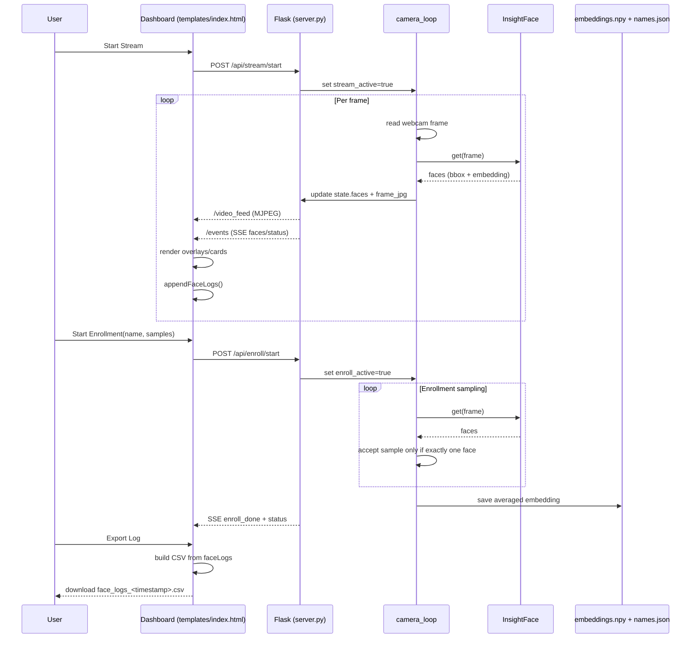
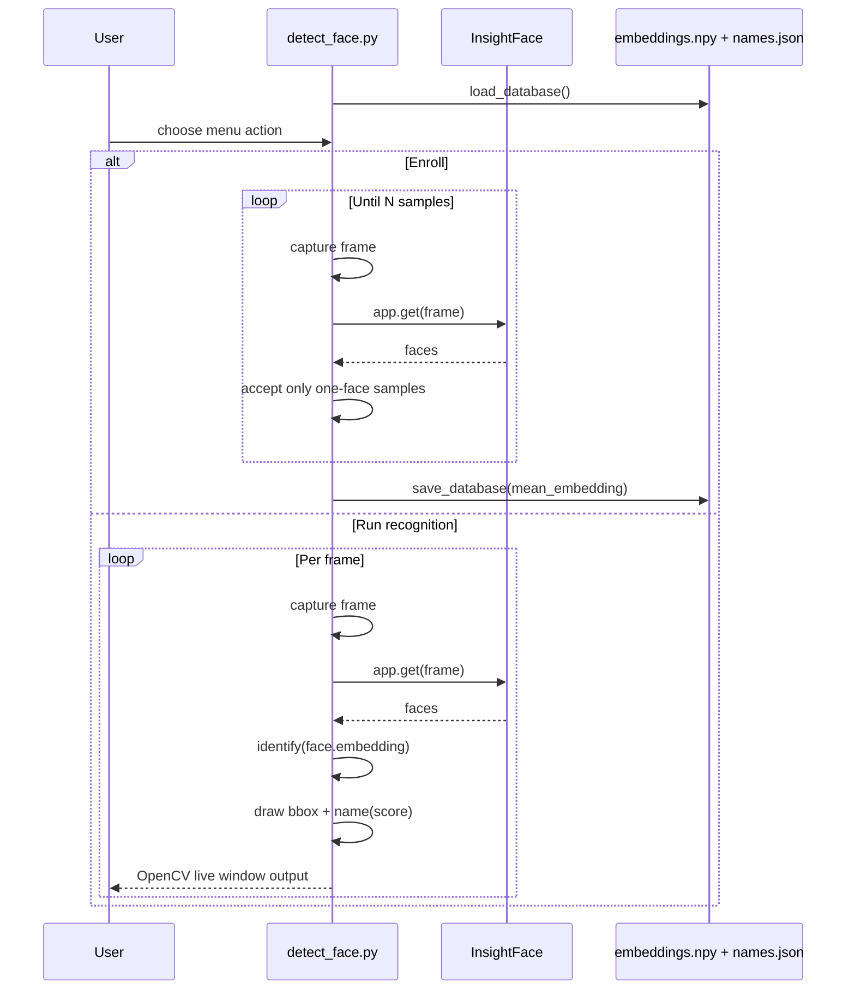

# Face Recognition Inference, Detection, and Logging Overview

This project has two runnable entry points:

- `detect_face.py`: terminal/OpenCV app with a CLI menu.
- `server.py`: Flask web server + live dashboard (`templates/index.html`).

Both paths use the same recognition idea: detect faces with InsightFace, generate embeddings, compare those embeddings to enrolled people using cosine similarity, and decide known vs unknown using a threshold.

## 1) Core Inference Engine

### Model initialization

Both `detect_face.py` and `server.py` initialize InsightFace the same way:

- Model: `buffalo_l`
- Providers: `CoreMLExecutionProvider`, then fallback `CPUExecutionProvider`
- Detection size: `det_size=(640, 640)`

Inference call in both runtimes is:

- `faces = app.get(frame)` (or `face_app.get(frame)`)

Each face object provides:

- `face.bbox`: detection bounding box `(x1, y1, x2, y2)`
- `face.embedding`: face feature vector used for identity matching

### Matching logic (identification)

Matching is implemented in `identify(...)` in both files.

Pipeline:

1. Normalize the query embedding.
2. For each enrolled person embedding, normalize it.
3. Compute cosine similarity via dot product.
4. Keep the highest score.
5. If best score >= threshold (`0.45`), return that person; otherwise return `Unknown`.

So identification decision is:

$$
\text{identity} =
\begin{cases}
\text{best\_match} & \text{if } \max\_i\; \cos(q, e_i) \ge 0.45 \\
\text{Unknown} & \text{otherwise}
\end{cases}
$$

## 2) Enrollment and Database Production

### Storage format

Persistent identity store uses two files:

- `embeddings.npy`: array of embedding vectors (NumPy)
- `names.json`: ordered list of names

Order alignment is critical: name at index `i` maps to vector at index `i`.

### Enrollment in `detect_face.py`

- Captures from webcam.
- Requires exactly one face per accepted sample.
- Collects `ENROLL_SAMPLES = 10` embeddings, spaced by `ENROLL_CAPTURE_DELAY_MS = 800` ms.
- Averages the 10 vectors into one template embedding per person.
- Saves updated DB (`save_database`).

### Enrollment in `server.py`

- Triggered by `POST /api/enroll/start`.
- Camera thread enters enrollment mode.
- Every `ENROLL_DELAY_S = 0.8`, if exactly one face is visible, one embedding is appended.
- On completion: average collected vectors, write to DB via `db_save()`, mark enrollment done.

## 3) Detection Production (How detections are generated)

### CLI mode (`detect_face.py`)

`run_recognition(...)` loop:

1. Read frame from camera.
2. Detect faces with InsightFace.
3. For each face, run `identify(...)`.
4. Draw bounding box + label (`name (score)`).
5. Show frame in OpenCV window.

Detection output is visual only in this path (rendered overlays and console state), not persisted as structured logs.

### Web mode (`server.py` + `templates/index.html`)

`camera_loop()` thread is the detection producer:

1. Opens camera when streaming or enrollment is active.
2. Reads frame.
3. Runs `face_app.get(frame)`.
4. In recognition mode, builds `state["faces"]` list of objects:
   - `name`
   - `score`
   - `bbox`
5. Encodes annotated frame JPEG and stores in `state["frame_jpg"]`.

Downstream delivery:

- `GET /video_feed`: MJPEG stream of annotated frames.
- `GET /events`: server-sent events (SSE) with JSON payload containing `faces`, enrollment progress, and status flags.

So in web mode, detection is produced in the backend thread and consumed by the frontend via MJPEG + SSE.

## 4) Logging Production (How logs are created and exported)

Logging in this codebase is primarily frontend-side and in-memory (not server-side DB logging).

### Runtime face logging (`templates/index.html`)

The function `appendFaceLogs(faces, enrollActive)` creates log entries from SSE `faces` updates when stream is on.

Each log entry includes:

- `timestamp_iso`, `timestamp_ms`
- `name`
- `known` (boolean)
- `score`
- `bbox`
- `enroll_active`
- `stream_active`
- `first_success_global`

Important logging behavior:

- Uses `loggedNames` set to only log the first appearance per normalized name key.
- Tracks first successful known identification globally via `firstSuccessfulIdentification`.
- Caps memory with `MAX_FACE_LOGS = 20000`.

### Export / clear log actions

Frontend actions:

- `Export Log` -> `exportFaceLogs()`
- `Clear` -> `clearFaceLogs()`

Export behavior:

- Builds CSV in browser.
- De-duplicates again by name (first entry per name).
- Includes bbox columns and flags.
- Downloads file as `face_logs_<timestamp>.csv`.

Clear behavior:

- Wipes `faceLogs`.
- Resets `loggedNames` and first-success marker.

### Backend logging

Backend has minimal console logging (for example DB load count/startup message), but no persistent detection event log API or database table.

## 5) API Surface for Detection/Enrollment Lifecycle (`server.py`)

- `POST /api/stream/start`: starts detection stream mode.
- `POST /api/stream/stop`: stops stream and clears current faces.
- `POST /api/enroll/start`: starts enrollment session.
- `POST /api/enroll/cancel`: cancels enrollment.
- `GET /api/people`: lists enrolled identities.
- `DELETE /api/people/<name>`: removes identity and saves DB.
- `GET /video_feed`: annotated MJPEG output.
- `GET /events`: SSE telemetry (faces + enrollment status/progress).

## 6) File Roles at a Glance

- `server.py`: backend runtime, camera worker, inference, API endpoints.
- `templates/index.html`: active dashboard UI, SSE consumer, client-side face logging + CSV export.
- `detect_face.py`: standalone CLI/OpenCV app with enrollment and recognition loops.
- `embeddings.npy` + `names.json`: persisted identity database.
- `requirements.txt`: dependency list (`insightface`, `onnxruntime`, `opencv-python`, `numpy`, `flask`).

## 7) Notes and Observations

- There are two UI files: root `index.html` and `templates/index.html`.
- Flask route `/` renders `templates/index.html`, so that is the active web UI for `server.py`.
- Root `index.html` appears to target different API routes (`/api/status`, `/api/recognition/start`, etc.) that are not defined in `server.py`.

## 8) Complete Pipeline (End-to-End)

This section shows the full operational path from boot to final detection output and log export.

### A) Startup pipeline

1. Process starts (`python detect_face.py` or `python server.py`).
2. InsightFace model is initialized (`buffalo_l`, CoreML -> CPU fallback).
3. Existing identity DB is loaded from `embeddings.npy` + `names.json`.
4. Runtime loop waits for operator control:
   - CLI: menu choice.
   - Web: API control (`/api/stream/start`, `/api/enroll/start`).

### B) Enrollment pipeline (identity production)

1. Start enrollment with person name and sample count.
2. Capture webcam frame.
3. Detect faces on frame.
4. Gate by enrollment constraints:
   - exactly one face -> accept sample,
   - zero or multiple faces -> reject sample and continue.
5. Collect embeddings over time (`~0.8s` spacing).
6. Compute mean embedding for stability.
7. Persist identity template to DB files.
8. Update UI/console enrollment status to complete.

Output of enrollment: one stable reference vector per enrolled person.

### C) Recognition pipeline (detection + identification)

1. Capture webcam frame.
2. Run face detector + embedding extractor (`app.get(frame)`).
3. For each detected face:
   - normalize query embedding,
   - cosine compare against all enrolled embeddings,
   - take highest score,
   - apply threshold `0.45`.
4. Emit per-face result tuple:
   - `name` (or `Unknown`),
   - `score`,
   - `bbox`.
5. Render overlays on frame (box + label).

Outputs of recognition:

- Visual stream overlays (CLI window or MJPEG frame).
- Structured detection payload in web mode (`state["faces"]` -> SSE `/events`).

### D) Logging pipeline (web dashboard)

1. Frontend receives SSE payload with current `faces`.
2. `appendFaceLogs(...)` converts detections into log records.
3. De-dup guard logs each normalized name once (`loggedNames`).
4. First known detection is tagged with `first_success_global=true`.
5. Log buffer is memory-bounded (`MAX_FACE_LOGS=20000`).
6. Export path converts (de-duplicated by name) entries into CSV and downloads.

Output of logging: browser-downloaded CSV file (`face_logs_<timestamp>.csv`).

### E) Sequence diagram: web runtime

### F) Sequence diagram: CLI runtime

## 9) Current Logging Guarantees and Limits

- Logging is ephemeral (in browser memory) unless exported.
- Logging is not a full event stream archive: it keeps first-seen entries per normalized name.
- CSV export is snapshot-at-click, generated on client side.
- No backend persistent log table/file currently exists.
